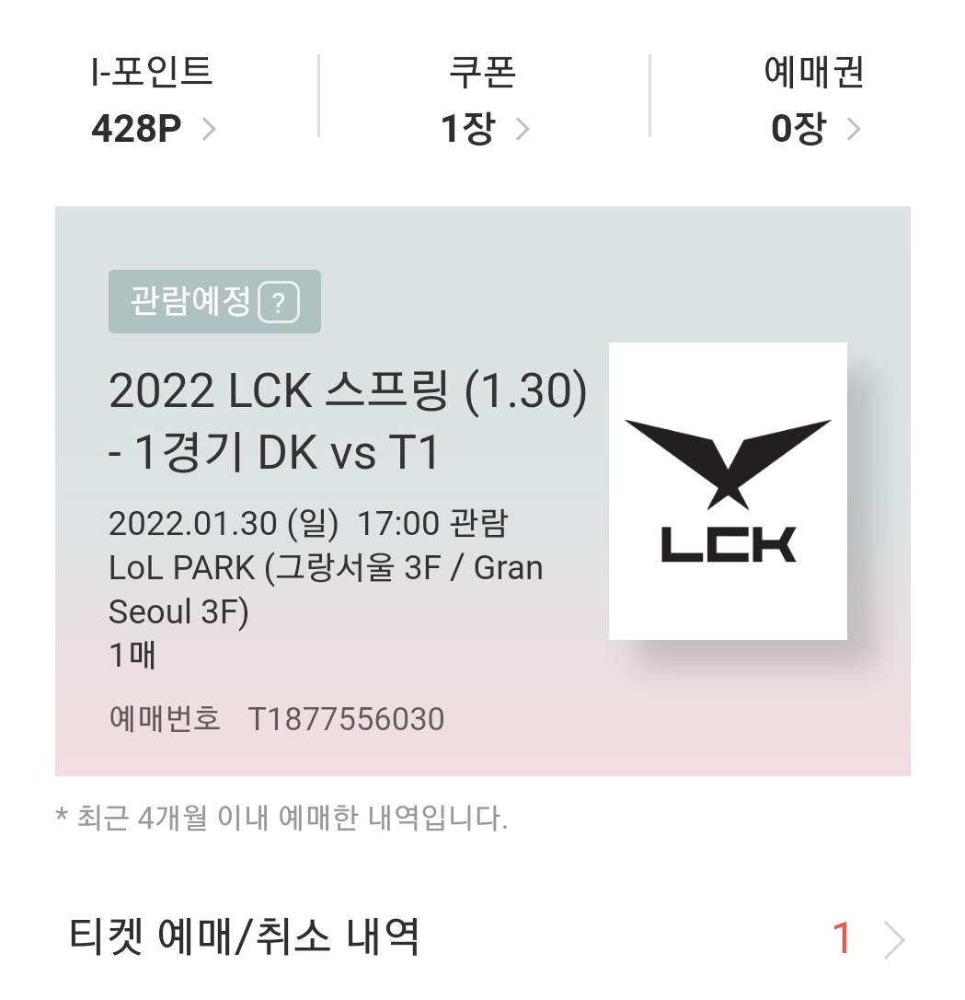
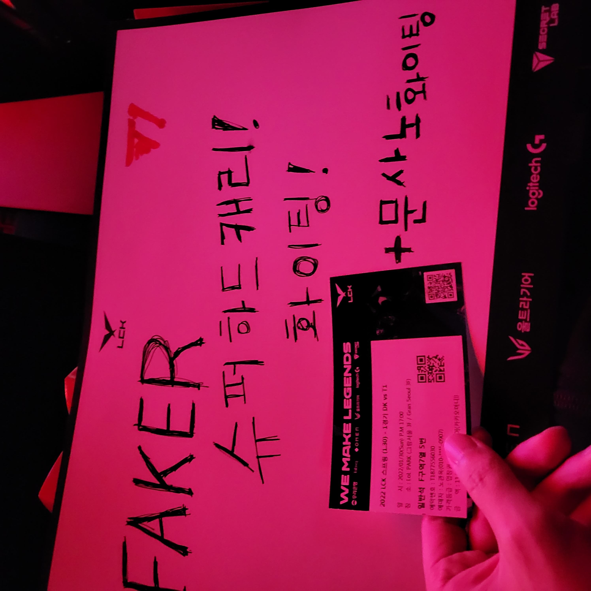
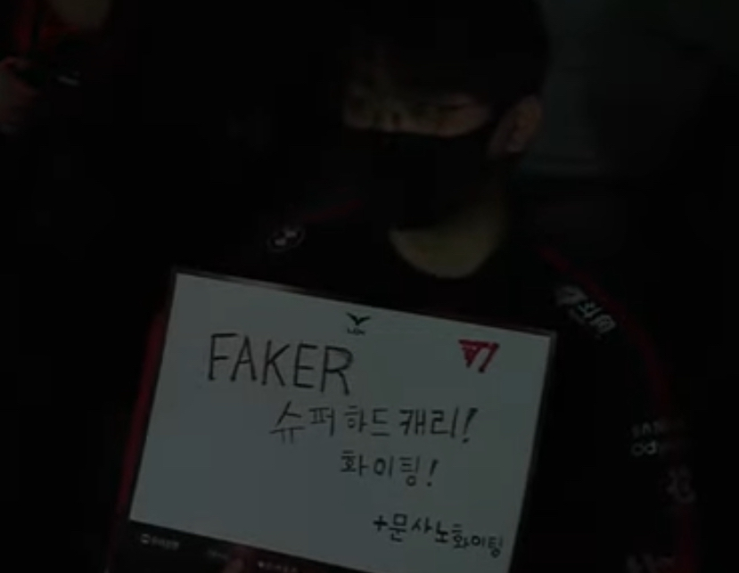
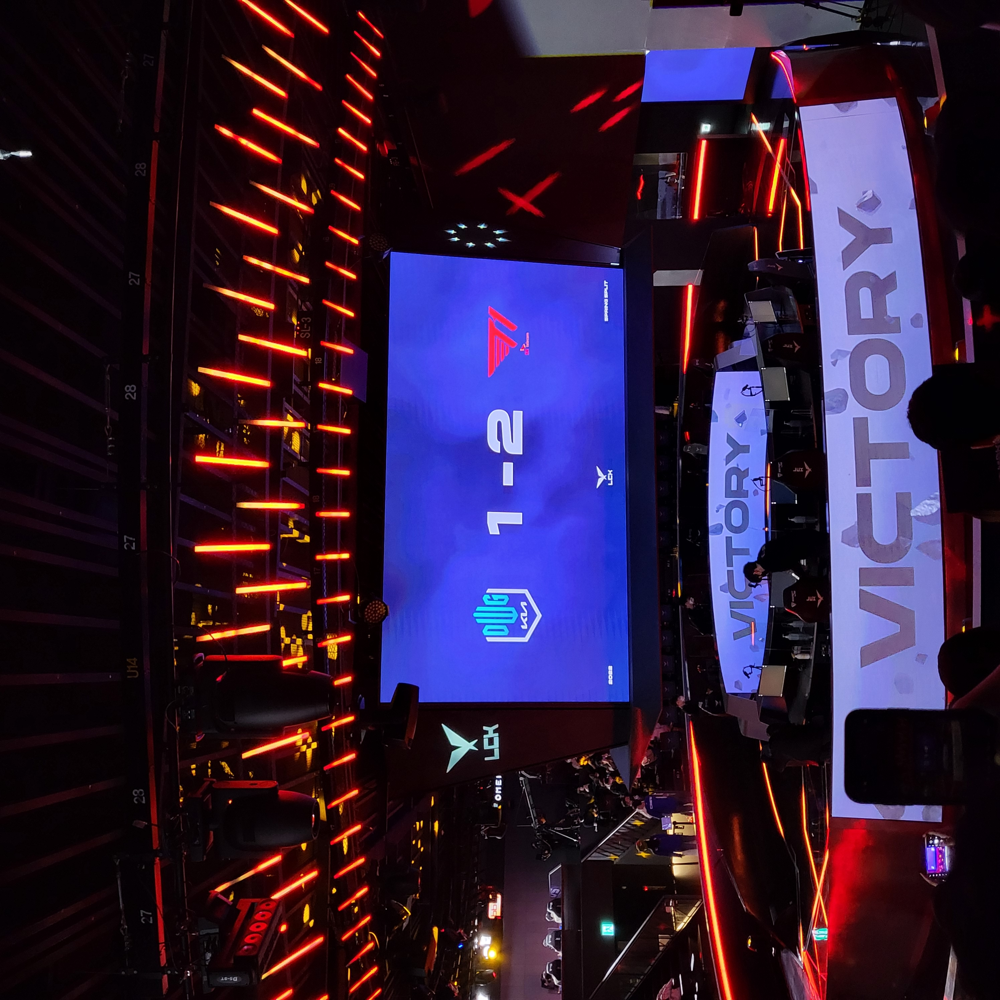
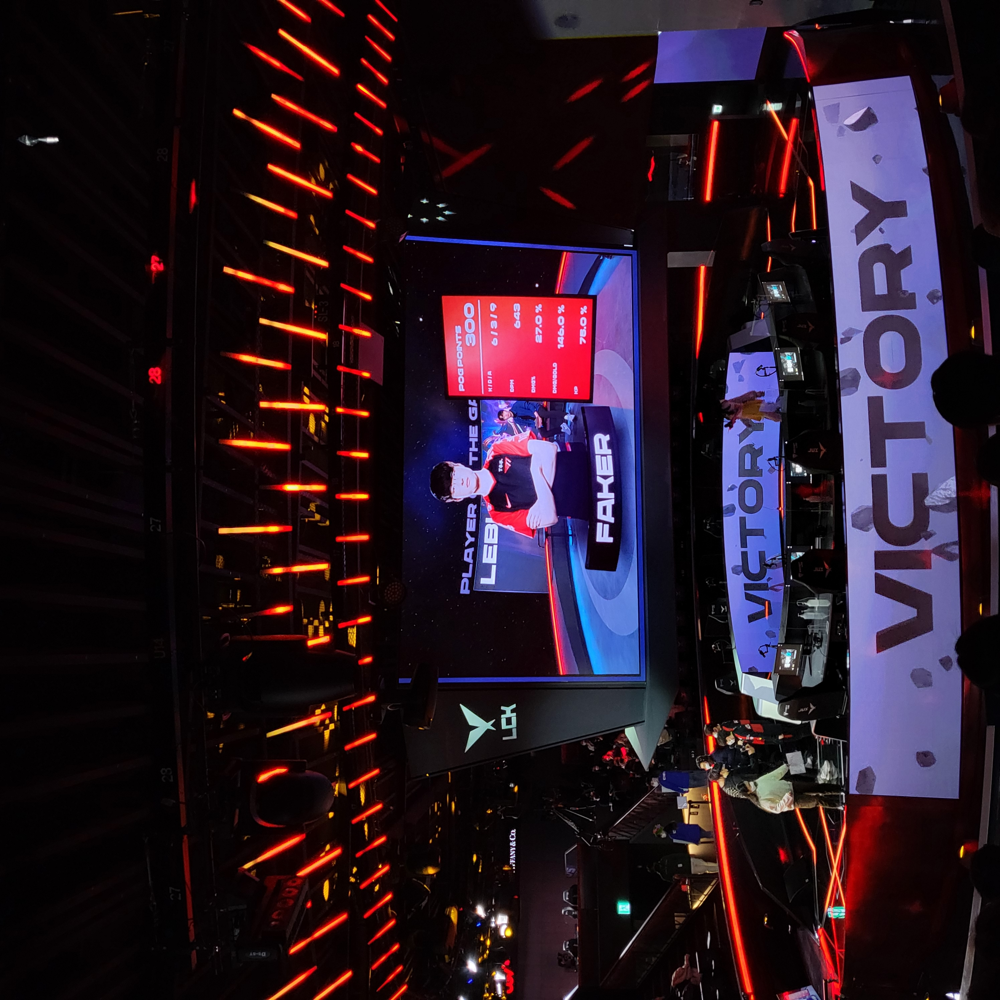
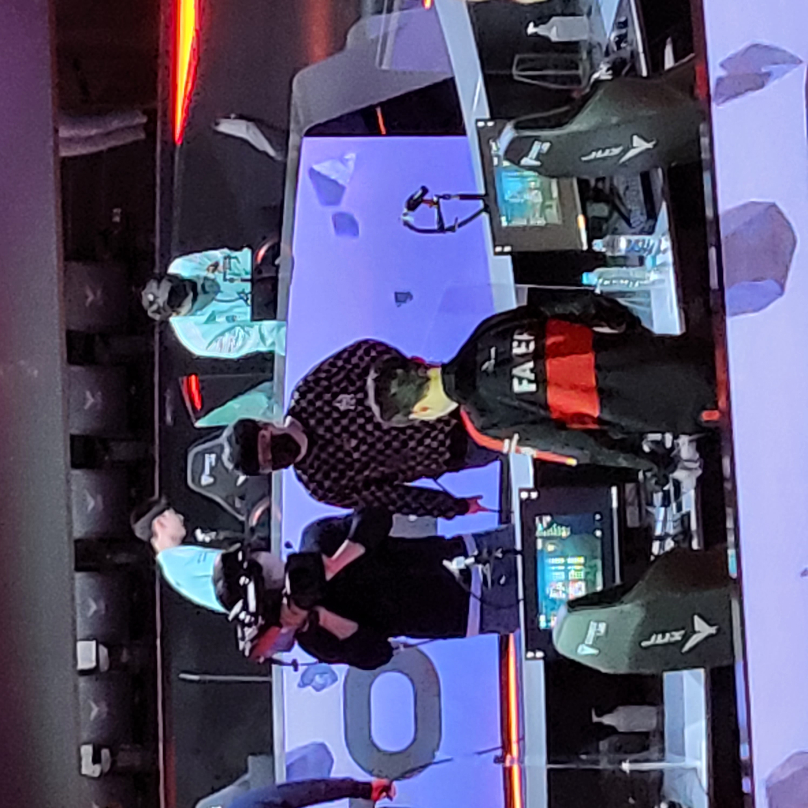

### 😆 경기 3시간 전
***

작년까지 엄청난 포스로 롤드컵 결승까지 간 담원과 빅매치라 그런가 엄청 빡센 티케팅이었지만,,

이 날 아침부터 지켜본 결과 티원 진영에 하나 잡았어요 하하

롤은 자리가 별로 없어서 티케팅 엄청 빡셉니다...

근데 이번에 가본 결과 굳이 앞자리일 필요가 없더라구요?

오히려 저는 뒷자리가 화면도 편하게 보이고 좋았어요 ㅇ.ㅇ

### 🎉 치어풀
***

친구가 자기 이름 화이팅 써달라고 그랬는데

알고보니 경기 시작하기 전에 이걸 검열하네요...??

그래서 페이커 화이팅 써놓고 밑에 끼워넣었어요 ㅋㅋㅋ

다음엔 뭔가 더 재밌는 치어풀을 그려서 카메라에 잡혀봐야겠어요.

### 🎯 그래도 잡히긴 했습니다 ㅋㅋ
***

좀 흐리지만 저는 이 날 티원 마스크와 자켓을 입고 갔어요 :)

### 🙌 패승승!!!!
***

1세트 지고 역시 담원은 티원의 천적이라고 생각했는데요

2세트에서 깔끔하게 이기더니

3세트는 벤픽부터 티원이 너무 유리하게 시작했는데, 초반에 캐니언이 오너의 동선을 완벽하게 파악하면서 레드를 스틸하고 스노우볼을 굴렸는데요

사실 그렇게 불안하지 않았어요. 왜나면 조합차이가 나서 레넥톤이랑 진은 없는 느낌이라 결국 3.5대 5싸움 같았거든요.

근데 그웬이 너무 잘커서 중간에 넥서스가 터질 뻔 했지만 그걸 또 오너가 시간을 잘 끌어주고

제우스랑 오너가 말리긴 했지만 케이틀린과 페이커의 르블랑이 잘 성장해서 캐니언의 그웬을 마크했고

결국 티원이 역전에 성공했어요!

### 😎 POG FAKER
***

3세트 POG는 그웬을 잘 마크해준 페이커가 가져갔어요.

작년만 해도 페이커가 1등이라는 생각은 안들었는데,,,

조심스럽게 요즘 기준으로는 그래도 페이커가 미드 중에 제일 잘하는 것 같아요.

경기 끝나고 트위치라이브에서 구마유시선수가 "솔킬 따였는데 POG는 아니지 않나..." 라고 했지만

솔킬 따였어도 받을만 했다고 생각해요 ㅎㅎ

### 🥲 다음 젠지전도 기대해봅니다!
***

지금 티원은 6승 0패로 단독 선두를 달리고 있는데요

다다음 경기가 2월 12일 토요일에 2등인 젠지와 대결이에요.

직관을 못 할 경우를 대비해 제가 사는 곳에 있는 시네마룸을 예약하긴 했지만

꼭 티케팅에 성공해서 직관가고싶네요 :)

\#T1WIN
