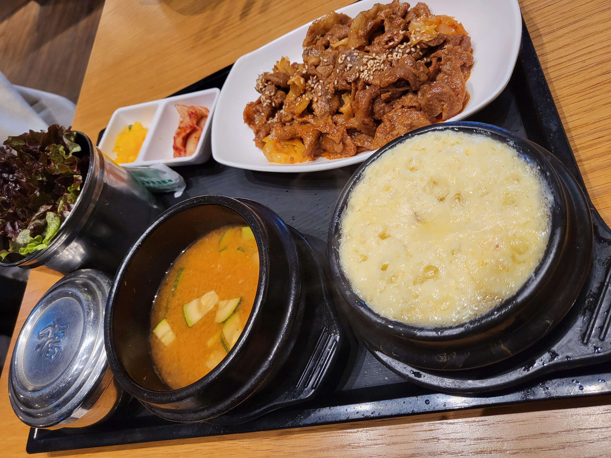
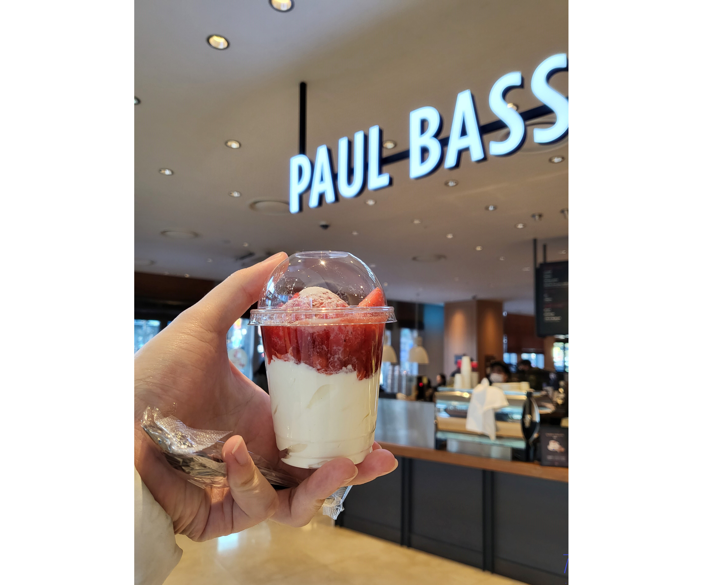
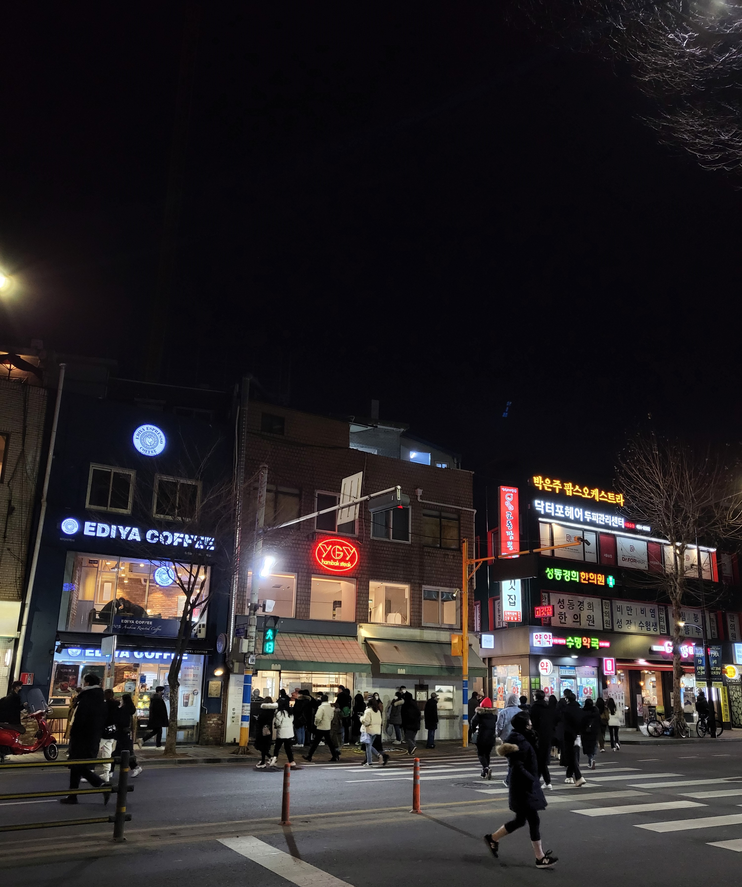
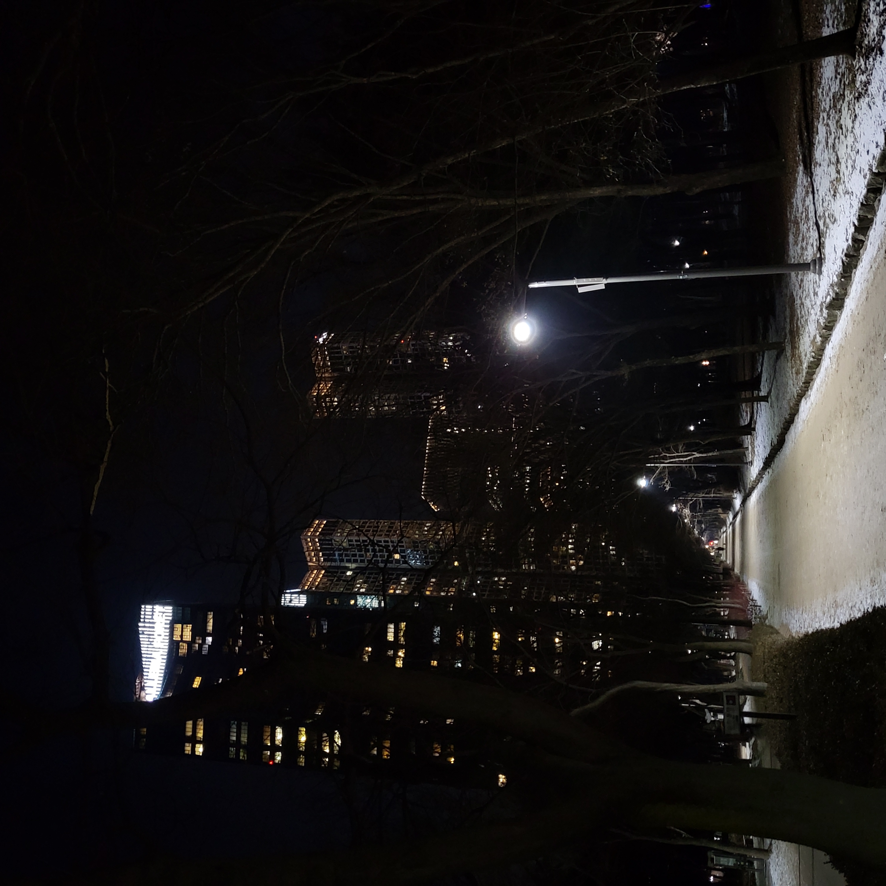
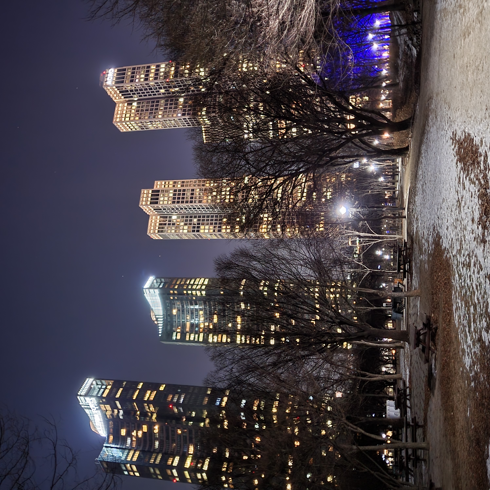
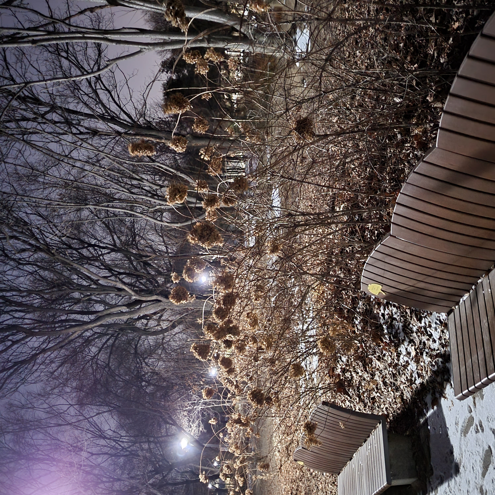
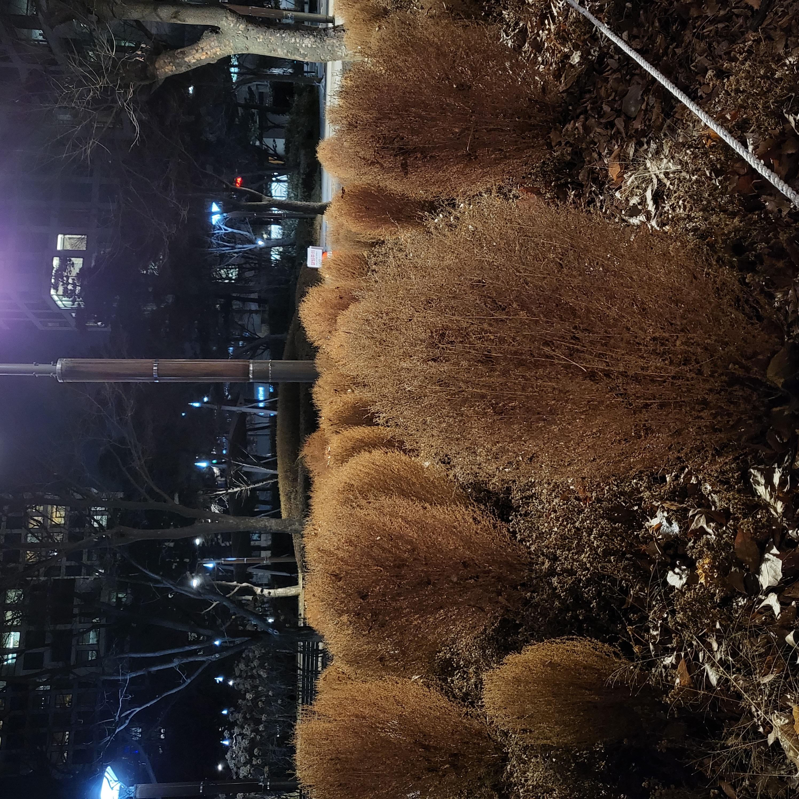

### 🍳 계란찜이 본체
***

여긴 회사 근처 미래에셋 건물 지하 푸드코트인데요

돈까스도 맛있고 텐동도 맛있지만

이게 제육쌈정식인가? 암튼 이 메뉴도 정말 맛있어요

된장국도 맛있고 제육볶음도 맛있고 계란찜이 진짜 맛있어요 😋

### 🍓 후식
***

후식은 폴바셋의 생딸기 아이스크림이에요.

폴바셋은 비싼 것만 빼면 참 완벽할텐데요...

그래도 저는 카페중에 폴바셋이 제일 좋습니다!

### 😁 퇴근!
***

퇴근하고 서울숲에 갔어요!

요즘 뭔가 집에서 공부만 하다보니 산책도 하고싶더라구요

서울숲 온 김에 스콘 집에 사가려고 했는데 역시 사람이 많네요

패스!

### 🌳 서울숲
***

이 날이 21일 금요일이었는데 사람이 별로 없더라구요?

사람이 없으니까 진짜 겨울같아요.

나뭇잎도 없고 그래서 더 쓸쓸한 서울숲입니다. 😅

### 🏙 너무 높은 집
***

집은 왜 이렇게 비싼걸까요

여기 온 사람들은 다들 저런 집에 살고싶다고 생각할 것 같은데요

아무리 생각해도 저 곳은 너무 높네요 ㅎㅎ

더 많이 성장해야겠습니다 화이팅!

### 🍃 시들어도 예쁜 꽃
***

분위기가 좋아서 찍었는데

그 분위기를 다 담지 못했네요 🤔

갤럭시가 야간촬영 모드해서 그런가봐요.

전 장인이 아니라서 내년엔 꼭 아이폰을 사고말겠어요.

이건 서부영화에 굴러다니는 것 처럼 생겼지만

얘도 실물로 보면 참 예뻐요.

춥지만 않았어도 더 걸어다니는 건데

아무튼 잘 걷고 들어갑니다~ 😀😀
