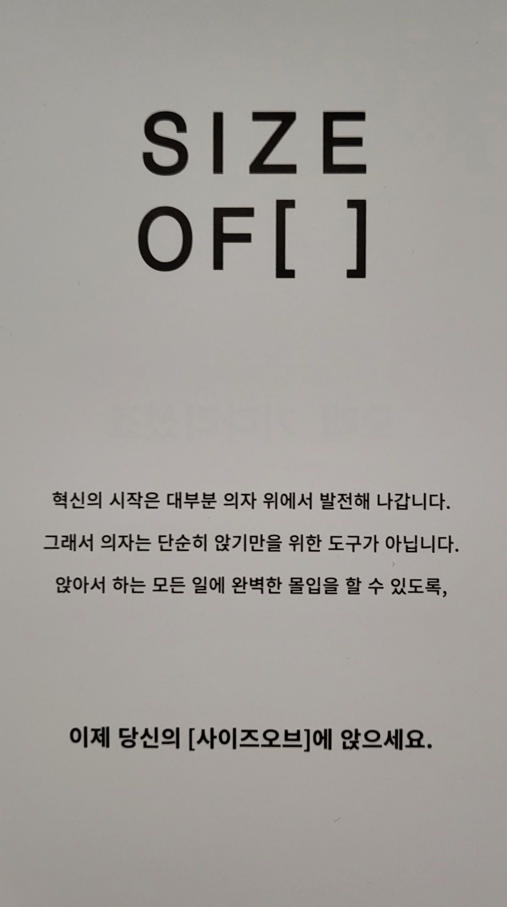
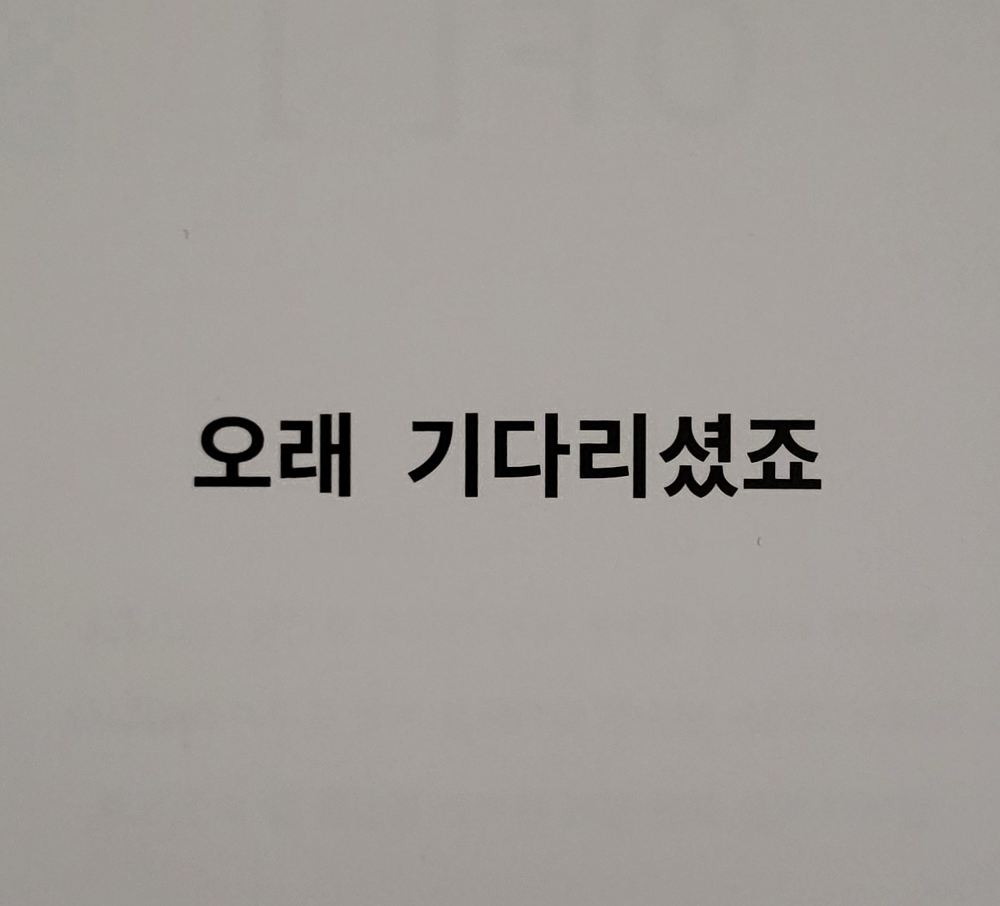
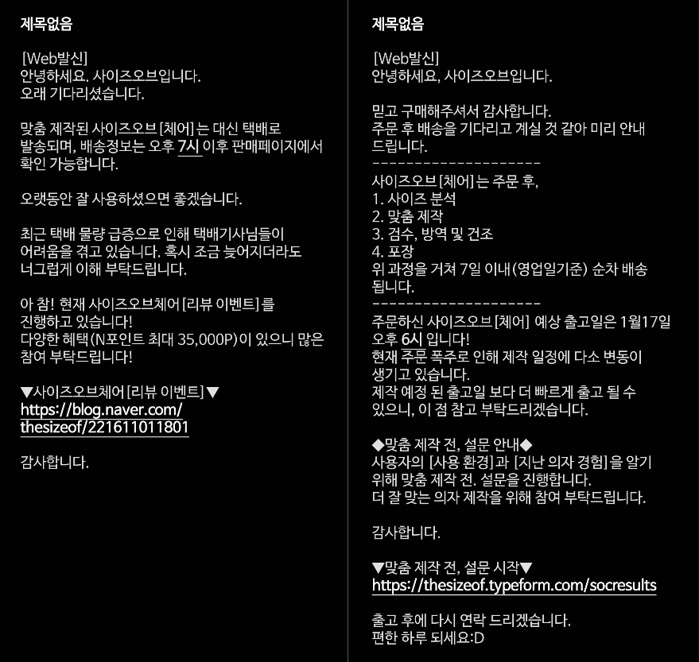
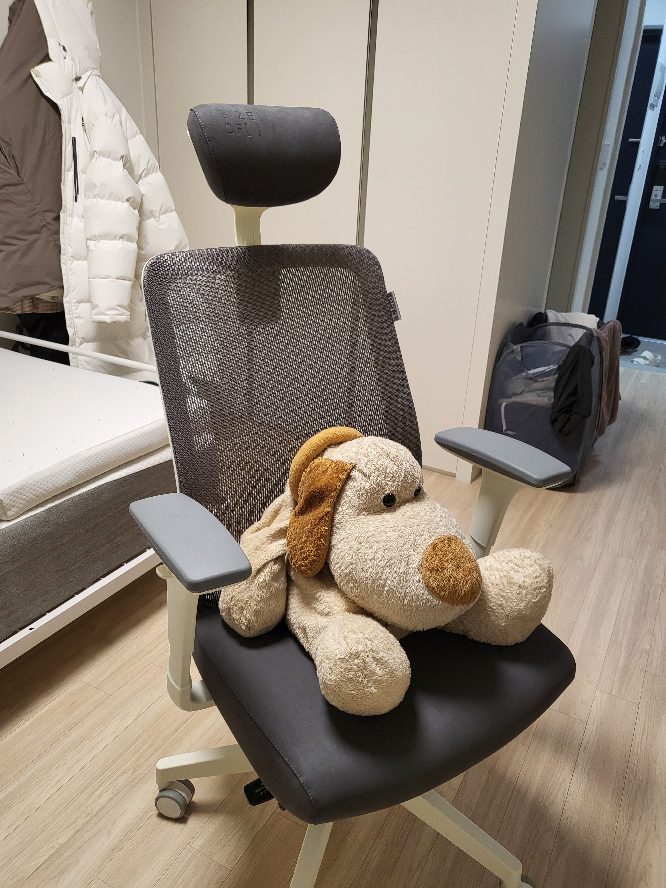
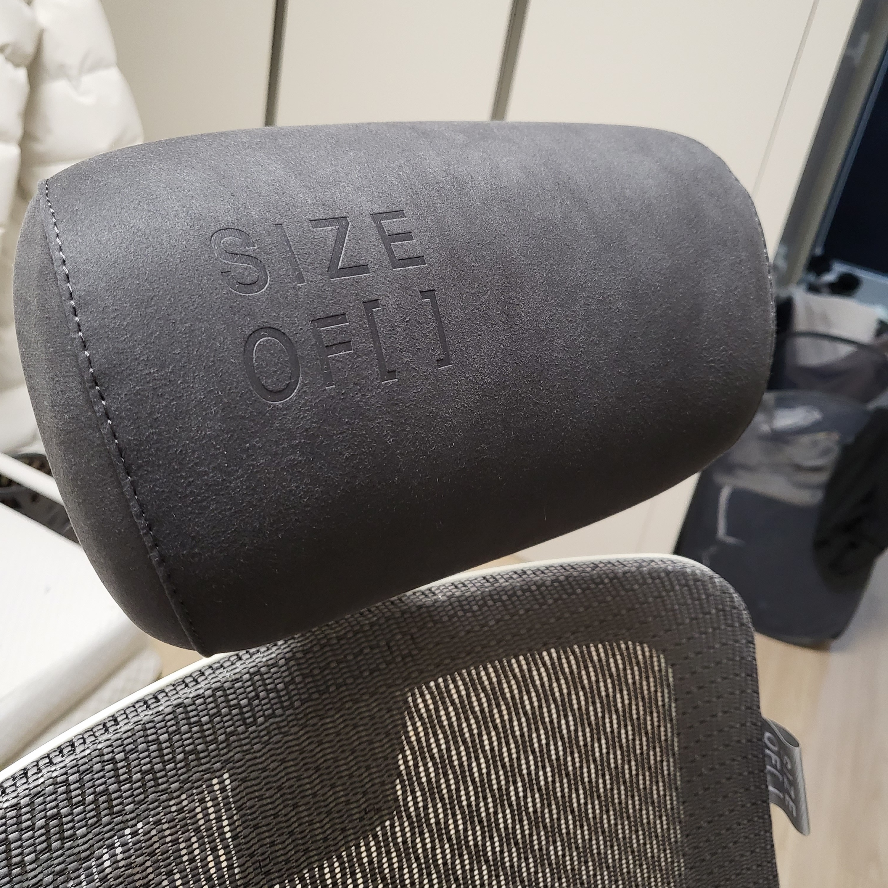
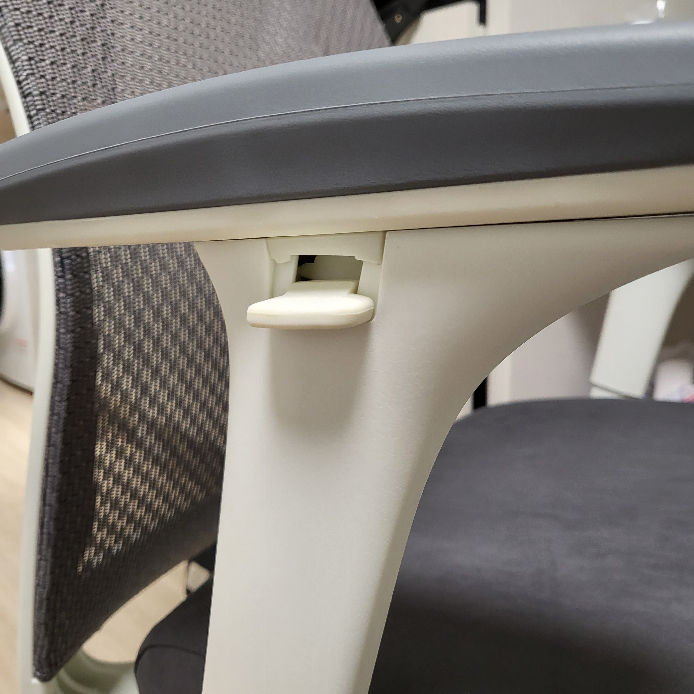
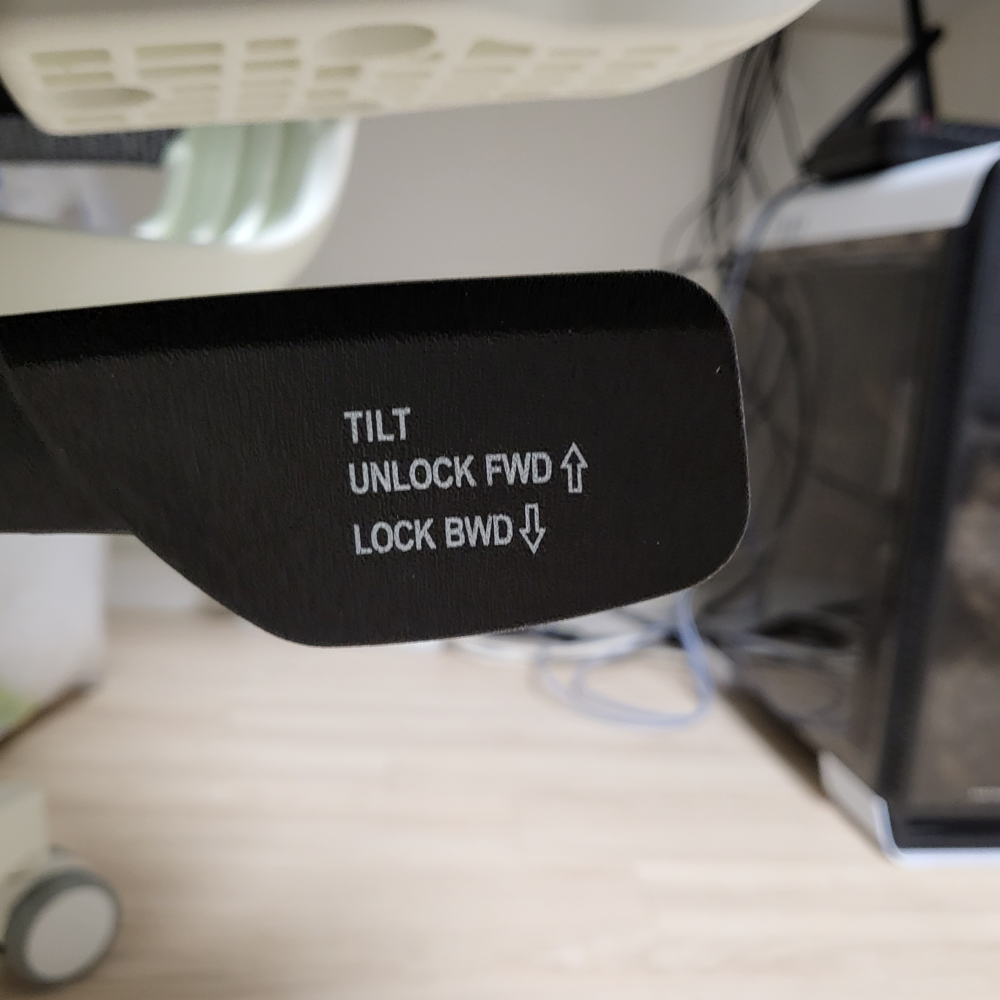
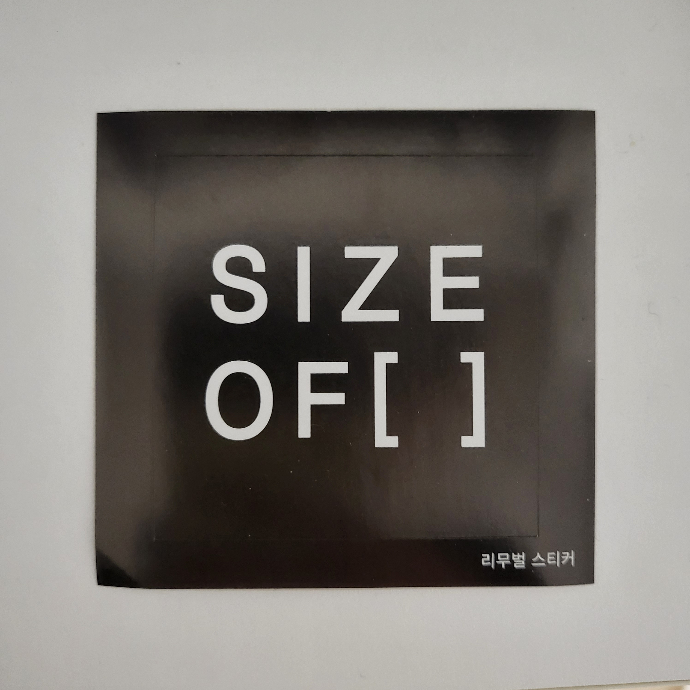

## 허리를 위한 투자

요즘 집에 오면 대부분 시간을 개발이나 공부에 쏟는데 집에 있는 의자가 너무 불편해서요 😢

유튜브에서 영상을 찾아보다가 사이즈 오브 체어라는 브랜드를 찾았어요.

가격이 47만원이라 비싸서 동생한테 사달라고 했는데,

퇴근하고 주문한다고 해서 결국 못 참고 제가 샀습니다 하하 😀

### 🕝 일주일 기다림

예, 오래 기다렸지요.

주문하고 잊으려고 했지만 이런 문자 보내면서 사람 더 기다리게 만들더라구요?

진짜 딱 일주일 걸렸어요. 월요일에 주문해서 그 다음 주 월요일에 받았습니다.

배송은 대신택배로 왔고 전화로 문 앞에 놓겠다고 말씀해주시고 사진도 보내주셨어요 👍

박스가 엄청 커서 공간을 많이 차지해서 바로 쓰레기장에 버렸는데

오늘 보니까 집 공동현관문 앞에 깔려있더라구요.

덕분에 박스에 눈 털고 들어왔습니다.

### 👀 두둥

이 의자 좀 보세요 너무 예쁘지 않나요..?

기능도 기능이지만 집이랑 어울리는 화이트색 디자인에서 합격

### ☁️ 푹신푹신한 헤드쿠션

살면서 의자에 이런 게 달려있는 이유를 몰랐는데 자세를 잡아주는 데 큰 역할을 하더라구요.

저는 의자에 거의 눕다시피 앉는데,

이 쿠션이 목 뒤 쪽을 잡아주니까 엉덩이가 안밀리고 허리를 핀 자세를 유지하게 돼요

### 조작하기 쉬운 팔걸이

팔걸이가 있는 의자는 많지만 제가 앉았을 때 닿지 않으면 무용지물이죠.

사이즈 오브 체어의 팔걸이는 위 아래는 물론 앞으로도 옆으로도 움직여요.

그리고 힘을 세게 주지 않고도 조절 가능한 것도 마음에 들어요.

### 🪄 이건 뭔가 달라

그 동안 피시방이나 회사에서 썼던 의자들은 다 위 아래로 움직여서 의자를 젖히잖아요

근데 이건 앞 뒤로 움직이면서 찰칵! 소리가 나요

사실 별거 아닐 수도 있지만 저는 이상하게 이런 게 정말 마음에 들어요 🥰

### 💻 예쁜 스티커까지

빈 배열 또는 리스트의 크기는 0이죠

의자를 고를 때 0순위가 되겠다는 의미일까요?

저도 항상 0순위가 되겠다는 마음가짐으로 핸드폰 뒤에 붙였습니다 ㅋㅋ
